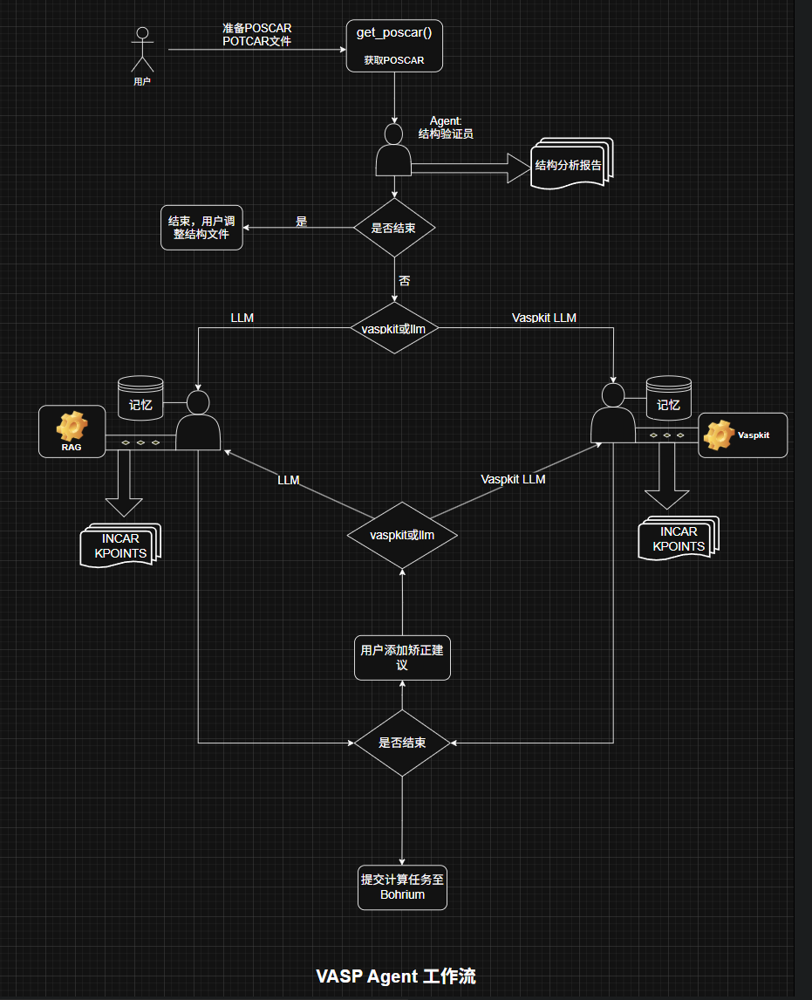

# Vasp Agent Crew

Welcome to the {{Vasp Agent Crew}} Crew project, powered by [crewAI](https://crewai.com). This template is designed to help you set up a multi-agent AI system with ease, leveraging the powerful and flexible framework provided by crewAI. Our goal is to enable your agents to collaborate effectively on complex tasks, maximizing their collective intelligence and capabilities.

## 安装

确保你的linux系统上安装了 Python >=3.10 <3.13 版本。本项目使用 [UV](https://docs.astral.sh/uv/) 进行依赖项管理和包处理，提供无缝的安装和执行体验。

首先，如果您还没有安装 uv，请安装

```bash
curl -LsSf https://astral.sh/uv/install.sh | sh              #linux
```
安装好后记得重启终端

然后安装crewai命令行
```bash
uv tool install crewai
```

要验证是否安装请运行：
```bash
uv tool list
```

您应该可以看到：
```bash
crewai v0.114.0
- crewai
```

接下来，导航到项目目录vasp_calculation_workflow并安装依赖项

**使用 CLI 命令安装它们**：
```bash
crewai install
```

本项目集成了强大的Vaspkit工具，为了让AI使用它，需要进行一些配置来启动工具

来到app/vaspkit.1.5.1下，运行：
```bash
./setup.sh
```
以及
```bash
source ~/.bashrc 
```


## 使用方式
将需要研究的结构文件POSCAR放置在vasp文件夹下，替换原有的文件
要运行时使用命令:
```bash
crewai run
```
第一次运行需要加载非常久，请耐心等待，因为需要构建向量库以支持检索增强生成（RAG）功能

VASP 计算工作流程团队由多个 AI 智能体组成，每个智能体具有独特的角色、目标和工具。

总的来说工作流先会经过结构验证员，他会检验结构文件的合理性，用户确认无误后可以选择使用deepseek-V3智能体或者Vaspkit智能体，其中前者能够在预先准备的vasp-wiki知识库中进行检索以增强他的输出，生成完整的结构文件，文件会自动被提取在vasp文件夹下。

而Vaspkit智能体能够自主调用vaspkit工具，根据结构文件的内容生成高度标准化且正确率高的参数文件。

一次生成之后用户可以根据效果选择补充信息以循环调用，一个比较好的实践是先选择vaspkit智能体，再根据实际需要补充提示，调用deepseek-v3，它则会根据已生成好的文件和用户补充提示进行针对性的修正。

生成的参数效果达到预期之后，可以选择停止。

**注：若有需要，将您的 `ACCESS_KEY` 添加到 `.env` 文件中，本项目提供提交计算功能，这样能在borium平台上看到计算执行情况。遇到计算任务提交失败问题请查看[bohrium命令行工具安装](https://bohrium-doc.dp.tech/docs/bohrctl/install/)**




- 开发指南：[crewai文档](https://docs.crewai.com/introduction)
- 修改 'src/vasp_calculation_workflow/config/agents.yaml' 以定义您的代理
- 修改 'src/vasp_calculation_workflow/config/tasks.yaml' 来定义你的任务
- 修改 'src/vasp_calculation_workflow/crew.py' 以添加您自己的逻辑、工具和特定参数
- 修改 'src/vasp_calculation_workflow/main.py' 以为您的代理和任务添加自定义输入


## Support


